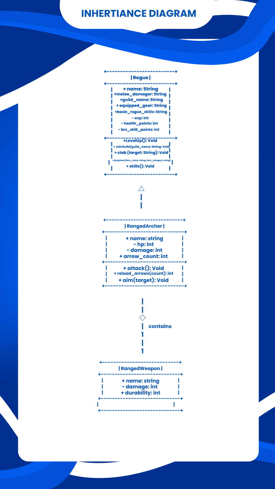
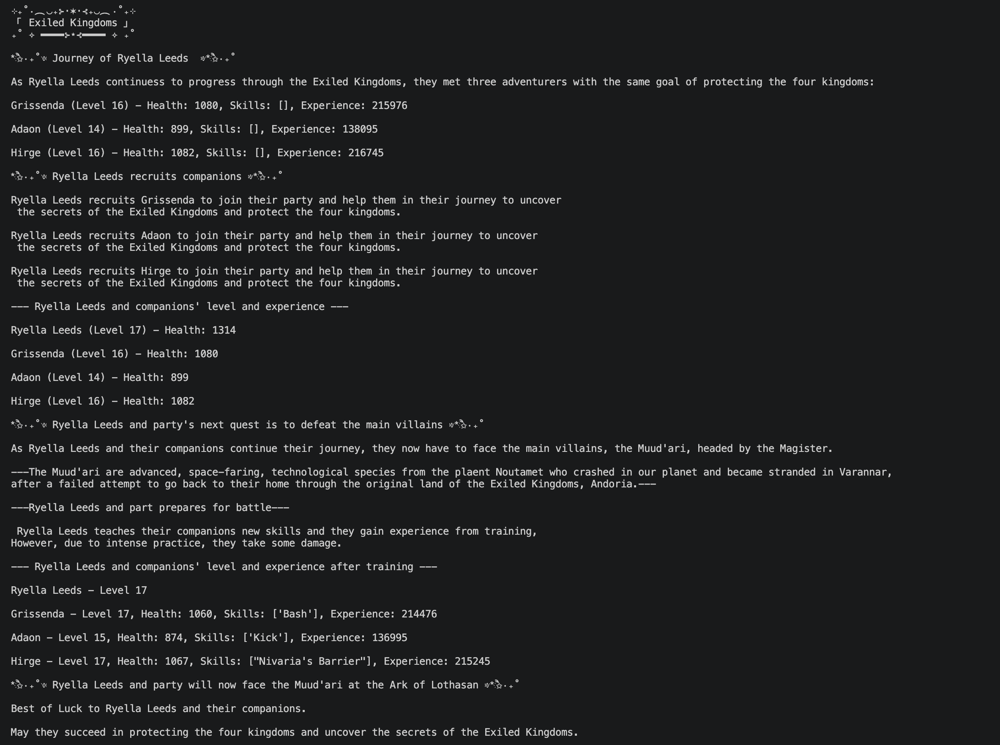
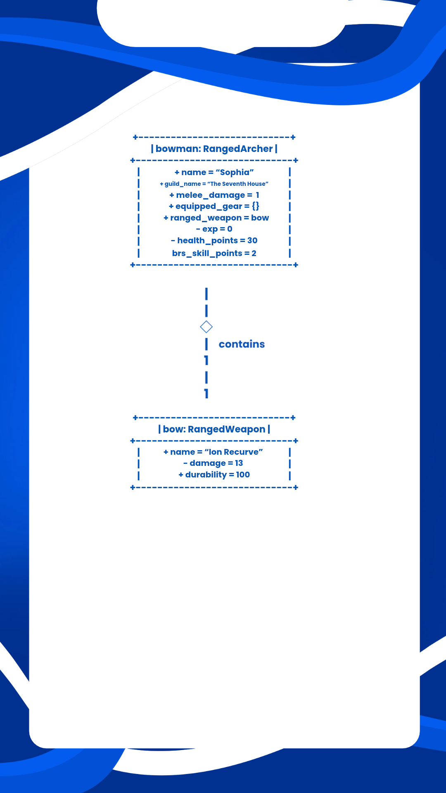

# Advanced Class Relationships

## Previous Activities
**[classAttrib](classAttributesMethods.md)**
**[classRel](classRelationships.md)**
---

## Existing System Description:

## Inheritance Relationship
**Parent:** Rogue

**Child:** RangedArcher (This is a new class since my previous classes have a "has-a" relationship with each other).

**Explanation:** A ranged archer is a type of rogue the specializes in archery and ranged attacks.

---
## Inheritance UML

## Composition/Aggregation
**Relationship:** Aggregation 

**Explanation:** The ranged archer has a ranged weapon that exists independently from the archer. The ranged weapon object is created separately and then passed to ranged archer. **If** ranged archer was destroyed, then it does not necessarily mean the weapon is destroyed as well.

## Advanced UML Diagram

## Python Implementation
[Source Code](advancedRelationships.py)

## Test Run

## Object Diagram

---
## Reflection
1. Why did you choose your inheritance relationship? Explain why your child class is a type of your
parent class.
- The child class, RangedArcher, showcases the inheritance relationship with the parent class because a ranged archer is a specialized version of a rogue. Moreover, the archer can have/use the attributes and methods of the class, Rogue, while still having independent features and methods.
2. How did inheritance reduce duplicate code? Identify attributes or methods that were reused.
- Inheritance reduced duplicate code because the class, RangedArcher, just reused some attributes and methods that the Rogue already has. In simpler terms, attributes and methods found in Rogue does not have to be written again in RangedArcher.
3. Why is your HAS-A relationship Composition or Aggregation? Explain the lifecycle relationship
between the two objects.
- The HAS-A relationship between RangedArcher and RangedWeapon is aggregation because the two classes can exist independently since the RangedWeapon and RangedArcher are created differently. Moreover, deleting the RangedArcher does not automatically mean that the RangedWeapon must also be deleted.
4. What is the difference between Association from Part III and the advanced relationship you
implemented?
- In OOPAct Part III, it was about association, a general relationship where two objects interact or have a relationship with each other. Meanwhile, in this activity, it focused on aggregation and/or composition where the two objects, RangedArcher and RangedWeapon, have a much advanced relationship.
5. How does your design follow the DRY principle?
- My design follow the DRY principle by making the RangedArcher inherit the existing attributes and methods of a Rogue instead of rewriting it. Moreover, the RangedWeapon class handles its own attributes keeping each class responsible for its own information.