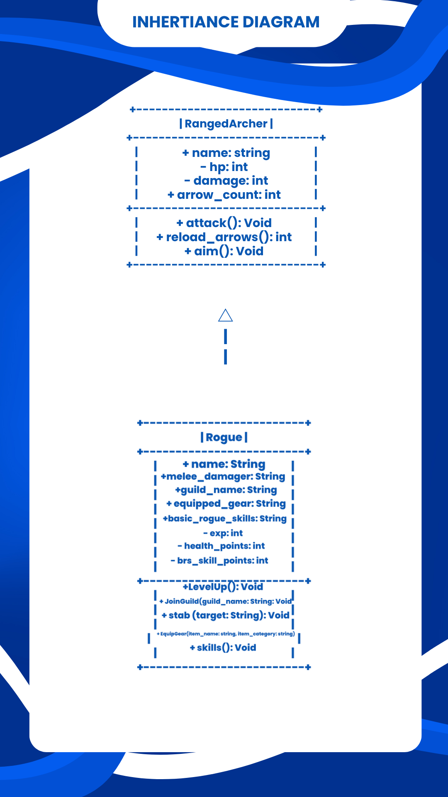

# Advanced Class Relationships

## Previous Activities
[classAttrib](classAttributesMethods.md)

[classRel](classRelationships.md)
---

## Existing System Description:

## Inheritance Relationship
**Parent:** Rogue

**Child:** RangedArcher (This is a new class since my previous classes have a "has-a" relationship with each other).

**Explanation:** A ranged archer is a type of rogue the specializes in archery and ranged attacks.

---
## Inheritance UML

## Composition/Aggregation
**Relationship:**
**Explanation:**

## Advanced UML Diagram
![Advanced UML]

## Python Implementation
[Source Code](advancedRelationships.py)

## Test Run
![Test]

## Object Diagram
![Objects]
---
## Reflection
1. Why did you choose your inheritance relationship? Explain why your child class is a type of your
parent class.
2. How did inheritance reduce duplicate code? Identify attributes or methods that were reused.
3. Why is your HAS-A relationship Composition or Aggregation? Explain the lifecycle relationship
between the two objects.
4. What is the difference between Association from Part III and the advanced relationship you
implemented?
5. How does your design follow the DRY principle?
