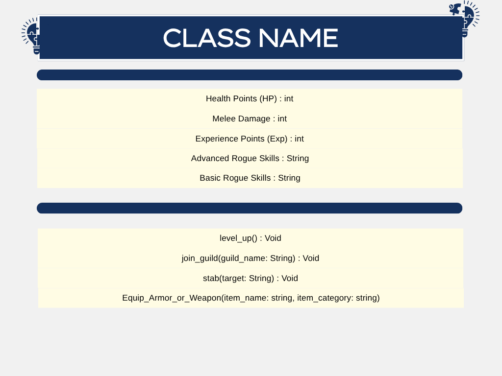

# SG4 - Understanding Classes and Objects
## Class Name: Rogue
- Context: Game - Exiled Kingdom

## Class Description
- Rogue is a class in the game *Exiled Kingdoms*, a game I played during the pandemic. Rogues are often called as thieves in the game and can be part of the Seventh House.
___

## Properties
| **Property** | **Data Type** | **Description** |
| --- | --- | --- |
| Health Points (HP) | int (integer) | This property represents the amount of damage the Rogue character can take before dying and reloading.|
| Melee Damage | int (integer) | This represents the amount of HP that will be subtracted from a target when the Rogue attacks while standing near it.|
| Experience Points (exp) | int (integer) | In the game, Exp is the amount of experience points the character has. After a certain amount of exp, the rogue would level up. |
| Advanced Rogue Skills | str (string) | These are skills that a Rogue can learn from fellow guild members once the character completes the guild quests and take the oath of loyalt. |
| Basic Rogue Skills | str (string) | Similar with other classes (Warriors, Clerics, and Mages), the rogue also has its own set of basic skills that can be used |
___

## Methods
| **Method** | **Description** |
| --- | --- |
| Level Up | This grants the character trait points and skill points. These points can be used to learn new abilities or level up the existing one (e.g., Stab --> Stab IV)|
| Join Guild | When a rogue joins a guild/faction, the character unlocks access to Advances Skills and faction-exclusive equipment. There are four guilds in Exiled Kingdom, but most rogues join The Seventh House (the Thieves' Guild). | 
| Stab | Stab is one of the most used rogue skill in the game. It can be learned since the start of the storyline or as the character levels up. Stab is when the character prepares for a single, deadly attack; afterwards, the character will have the chance to launch another attack that will deal with extra damage. |
| Equip Armor or Weapon | As a Rogue, it is important to have the necessary armor and weapon to combat enemies and finish of quests. In the game, there are multiple weapons and armors for the class Rogue. |

## Class Diagram

## Design Explanataion
### Why did you choose this class?
- I chose this class because in the game, *Exiled Kingdoms*, the rogue was my first ever character---it reached around level 35 before my cousin's phone broke. The game and the class are among my core memories during the pandemic which is why I chose it for this activity.
### Which property is the most important? Why?
- Personally, the most important property in this class is the Health Points or HP. This trait is one of the reasons why the character is still even alive and leveling up. HP adds excitement and challenge to the game because if characters were immortal, the purpose and challenge of playing an RPG game isn't even felt.
### Which method is the most useful? Why?
- The most important method is the level up because it allows the Rogue to become stronger by gaining trait points and skill points. Moreover, as characters level up, they become more exposed to riskier quests and overpowered weapons.