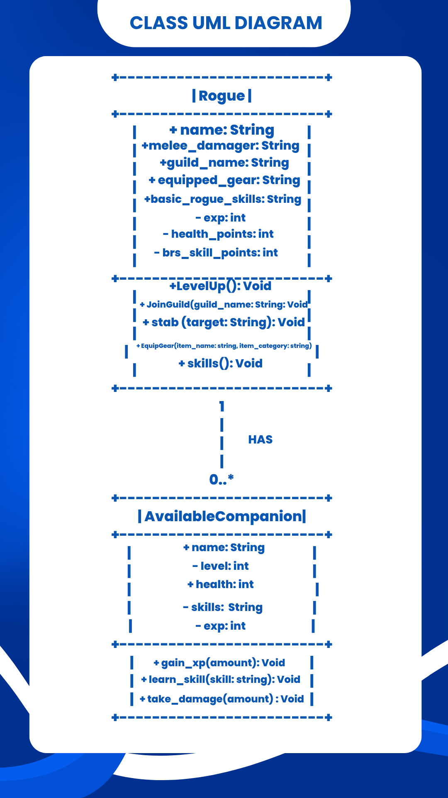
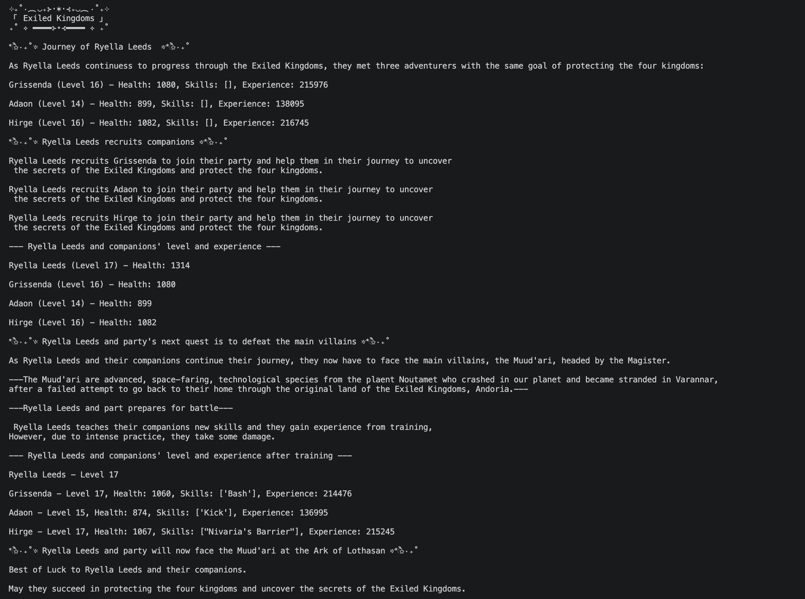

# Class Relationships: Association and Multiplicity
## Previous Work
[Part I - Classes and Objects](classObjectUML.md)

[Part II - Class Attributes and Methods](classAttributesMethods.md)

---

## Existing Class
**Class:** Rogue - Exiled Kingdoms

**Description**: 
- Rogues are often called as thieves in the game, **Exiled Kingdom**. These characters possess unique abilities such as Stab, Trap, and Sprint. Moreover, to further enhance the Rogue, they can join guilds to learn a new set of advanced skills.

## New Class
**Class:** AvailableCompanion

**Description:** In **Exiled Kingdom,** there are companions that are NPC's that can join the rogue on the journey or storyline of the game. Companions will follow and assist the rogue in attacking enemies. Companions have four types: Main Companions, Hired Mercenaries, Summond Creatures, and Quest NPC's. In this class, I wll focus on Main Companions

## Association 
**Relationship:** A rogue has companions.
**Explanation:** Again, the game contains companions which has only one goal---to help the main character (rogue). Moreover, the main companions have quests that can help the rogue to level up and gain new armor and weapon.

## Multiplicity
**Multiplicity:** *one-to-many*
**Explanation**: Since there are four types of companions, I chose to focus on the main companions, and the rogue has 3 available companions, but can only have one at a time. (1 Rogue : 3 Available Companions)

---

## UML Class Relationship Diagram

## Python Implementation
[View Python Source](classRelationships.py)

## Test Run

## Object Relationship Diagram
[Object Relationship Diagram](images/objectRelationshipDiagram.png)

--- 

## Analysis

### What is the association between your two classes?
- **In Exiled Kingdoms,** the rogue, main character, pairs with the main companions in completing multiple quests, leveling-up, and discovering new locations. *The association between my two classes is that the Rogue is the main character that progresses the actual storyline of the game, while the AvailableCompanion helps the Rogue.*
### What multiplicity did you choose and why?
- I chose the **one-to-many** multiplicity because *one main player/rogue can have at most 3 Available Companions in the game.*
### How did you implement the relationship in Python?
- In Python, I implemented my two classes by creating an instance variable inside the Rogue that holds a collection of the companion objects.
### Why did you store an object reference instead of copying its data?
- I used an object reference so it would be easier for me to update each companion's status without needing to manually copy the data, so it could reflect across the entire program. Moreover, it's just more efficient for me rather than duplicating each companion and modifying their data.
### If your relationship uses many, why is a list appropriate?
- A list would be appropriate here because it would be easier if I modify my code (e.g., remove a companion). Also, the list stores the actual object references in chronological order, allowing each companion to be accessed through the relationship.

## Declaration of AI
- During the preparation of this activity, I used Gemini 3.6 Flash and Chat GPT-6 Astra to improve my code through identifying errors. Moreover, I used these LLMs to further understand the concepts. After using the said tools, I reviewed and edited the content as needed.

## Reference:
Companions - Exiled Kingdoms Wiki. (n.d.). https://www.exiledkingdoms.com/wiki/index.php?title=Companions
